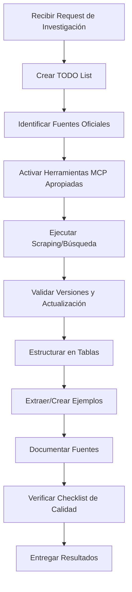

# Skill: Investigador de Documentación Técnica

## 📋 Descripción General

Rol especializado en **investigación exhaustiva de documentación técnica oficial**, utilizando herramientas avanzadas de scraping y agentes de búsqueda para recopilar, analizar y presentar información de forma estructurada y comprensible.

## 🔗 Integración documental del repositorio

- Carpeta documental canónica: [../../documentation](../../documentation)
- Agente de consolidación documental: [../../agents/senior-documentation-architect.agent.md](../../agents/senior-documentation-architect.agent.md)
- Cuando esta skill se use para investigación en este repo, los hallazgos deben integrarse en los artefactos definidos en:
  - [../../documentation/PROJECT-BASELINE.md](../../documentation/PROJECT-BASELINE.md)
  - [../../documentation/DOCUMENTATION-PLAYBOOK.md](../../documentation/DOCUMENTATION-PLAYBOOK.md)

## 🎯 Cuándo Usar Esta Skill

Activa esta skill cuando:
- ✅ Necesites buscar documentación oficial de tecnologías, frameworks o APIs
- ✅ Requieras comparar múltiples fuentes de documentación
- ✅ Debas investigar características específicas de una biblioteca o herramienta
- ✅ Necesites versiones actualizadas de documentación técnica
- ✅ Quieras analizar breaking changes o migration guides
- ✅ Requieras ejemplos de código de fuentes oficiales
- ✅ Necesites investigar best practices documentadas oficialmente

## 🔄 Workflow de Investigación

### Fase 1: Planificación y Context Management
```markdown
1. Crear TODO list con manage_todo_list
2. Identificar fuentes oficiales prioritarias
3. Definir scope de la investigación
4. Establecer criterios de búsqueda
```

### Fase 2: Activación de Herramientas MCP
```markdown
1. Evaluar tipo de investigación requerida
2. Activar herramientas MCP apropiadas
3. Configurar agentes especializados
4. Establecer parámetros de scraping
```

### Fase 3: Ejecución de Búsqueda
```markdown
1. Buscar en documentación oficial
2. Scraping de contenido relevante
3. Validar fuentes y versiones
4. Recopilar ejemplos de código
```

### Fase 4: Análisis y Estructuración
```markdown
1. Analizar información recopilada
2. Crear tablas comparativas
3. Extraer ejemplos significativos
4. Validar actualización de la información
```

### Fase 5: Presentación de Resultados
```markdown
1. Generar tabla descriptiva
2. Incluir ejemplos prácticos
3. Citar fuentes oficiales
4. Documentar versiones
```

## 🛠️ Herramientas MCP Disponibles

### 1. Apify Tools (Web Scraping & Documentation)

#### **Búsqueda en Documentación Oficial**
```javascript
// Activar herramientas Apify
- activate_apify_documentation_tools
- activate_apify_actor_management_tools

// Usar RAG Web Browser para documentación
mcp_apify_apify-slash-rag-web-browser({
  query: "Angular routing best practices site:angular.io",
  maxResults: 5,
  outputFormats: ["markdown"]
})
```

#### **Search en Apify/Crawlee Docs**
```javascript
mcp_apify_search-apify-docs({
  docSource: "apify",  // o "crawlee-js" / "crawlee-py"
  query: "actor input schema validation",
  limit: 5
})
```

#### **Fetch Documentación Completa**
```javascript
mcp_apify_fetch-apify-docs({
  url: "https://docs.apify.com/academy/web-scraping"
})
```

## Nota de Ortografía (aplicable a documentación)

Cuando esta skill genere hallazgos, resúmenes o artefactos documentales para el repositorio, aplicar las reglas en `.github/documentation/ORTHOGRAPHY-GUIDELINES.md`. Los documentos deben incluir en su encabezado la línea: "Ortografía verificada según .github/documentation/ORTHOGRAPHY-GUIDELINES.md".

### 2. Chrome Browser Tools (Interactive Research)

```javascript
// Activar herramientas de navegación
- activate_browser_navigation_tools
- activate_web_page_capture_tools

// Navigate to documentation
mcp_microsoft_pla_browser_navigate({ url: "..." })

// Capturar snapshot de documentación
mcp_microsoft_pla_browser_snapshot({ filename: "docs-snapshot.md" })

// Evaluar JavaScript en la página
mcp_io_github_chr_evaluate_script({
  function: "() => document.querySelector('.version').innerText"
})
```

### 3. Puppeteer Tools (Advanced Scraping)

```javascript
// Activar herramientas de scraping
- activate_web_scraping_data_extraction_tools

// Extraer campos específicos
mcp_puppeteer_puppeteer_scrape_fields({
  url: "...",
  fields: {
    "version": "div.version",
    "description": "p.description",
    "examples": "pre code"
  }
})
```

### 4. WebScrapingAI Tools

```javascript
// Extraer texto estructurado
mcp_webscrapingai_webscraping_ai_text({
  url: "https://docs.example.com",
  text_format: "json"
})

// Hacer preguntas sobre el contenido
mcp_webscrapingai_webscraping_ai_question({
  url: "...",
  question: "¿Cuáles son los breaking changes en la versión 10?"
})
```

### 5. Lighthouse Tools (Quality Assessment)

```javascript
- activate_website_performance_and_accessibility_tools

// Validar calidad de documentación
mcp_lighthouse_get_accessibility_score({ url: "..." })
```

## 📊 Formato de Output: Tablas Descriptivas

### Template de Tabla Estándar

```markdown
| Concepto | Descripción | Versión | Fuente Oficial | Uso Recomendado |
|----------|-------------|---------|----------------|-----------------|
| Feature X | Brief description | v10.2 | [Docs](url) | Use when... |
| Feature Y | Brief description | v10.2 | [Docs](url) | Use when... |
```

### Template de Tabla Comparativa

```markdown
| Feature | Angular 9 | Angular 18 | Breaking Changes | Migration Path |
|---------|-----------|------------|------------------|----------------|
| HttpClient | Injectable | Injectable | None | No change needed |
| ViewChild | static:false | signal() | API change | Use computed() |
```

### Template de Tabla de Configuración

```markdown
| Opción | Tipo | Default | Descripción | Ejemplo |
|--------|------|---------|-------------|---------|
| apiKey | string | required | API authentication | `"abc123"` |
| timeout | number | 5000 | Request timeout (ms) | `10000` |
```

## 💡 Ejemplos Prácticos de Investigación

### Ejemplo 1: Investigar Nueva Feature de Angular

**TODO List:**
```markdown
1. ⬜ Buscar documentación oficial de Angular signals
2. ⬜ Scraping de ejemplos de código
3. ⬜ Comparar con RxJS approach
4. ⬜ Generar tabla comparativa
5. ⬜ Documentar migration path
```

**Ejecución:**
```javascript
// 1. Buscar en docs oficiales
mcp_apify_apify-slash-rag-web-browser({
  query: "Angular signals API site:angular.io OR site:angular.dev",
  maxResults: 5
})

// 2. Capturar ejemplos específicos
mcp_webscrapingai_webscraping_ai_fields({
  url: "https://angular.dev/guide/signals",
  fields: {
    "basicExample": "code-example[header='Basic Signal']",
    "computedExample": "code-example[header='Computed']",
    "effectExample": "code-example[header='Effect']"
  }
})
```

**Output Esperado:**
| Feature | RxJS (Actual) | Signals (New) | Cuándo Usar Signals |
|---------|---------------|---------------|---------------------|
| Estado reactivo | `BehaviorSubject` | `signal()` | Estado simple sin async |
| Valores derivados | `combineLatest + map` | `computed()` | Cálculos síncronos |
| Side effects | `subscription` | `effect()` | Reacciones a cambios |

**Ejemplo de Código:**
```typescript
// ❌ Approach anterior (RxJS)
export class Component {
  private count$ = new BehaviorSubject(0);
  doubleCount$ = this.count$.pipe(map(c => c * 2));
}

// ✅ Approach nuevo (Signals)
export class Component {
  count = signal(0);
  doubleCount = computed(() => this.count() * 2);
}
```

**Fuente:** [Angular Signals Guide](https://angular.dev/guide/signals) (v18.0)

---

### Ejemplo 2: Investigar API de Terceros

**TODO List:**
```markdown
1. ⬜ Identificar versión actual de la API
2. ⬜ Scraping de endpoints disponibles
3. ⬜ Extraer modelos de request/response
4. ⬜ Documentar autenticación
5. ⬜ Crear tabla de endpoints
```

**Ejecución:**
```javascript
// 1. Navegar a docs
mcp_microsoft_pla_browser_navigate({ 
  url: "https://api.example.com/docs" 
})

// 2. Extraer versión
mcp_io_github_chr_evaluate_script({
  function: "() => document.querySelector('.version').innerText"
})

// 3. Scraping de endpoints
mcp_puppeteer_puppeteer_scrape_fields({
  url: "https://api.example.com/docs",
  fields: {
    "endpoints": ".endpoint-list .endpoint-item",
    "methods": ".endpoint-item .method",
    "descriptions": ".endpoint-item .description"
  }
})
```

**Output Esperado:**
| Endpoint | Método | Autenticación | Descripción | Rate Limit |
|----------|--------|---------------|-------------|------------|
| `/users` | GET | Bearer Token | Lista usuarios | 100/min |
| `/users/:id` | GET | Bearer Token | Usuario por ID | 100/min |
| `/users` | POST | Bearer Token + Admin | Crear usuario | 10/min |

**Ejemplo de Request:**
```typescript
// GET /users/:id
const headers = {
  'Authorization': `Bearer ${token}`,
  'Content-Type': 'application/json'
};

const response = await fetch(
  'https://api.example.com/v2/users/123',
  { headers }
);

// Response: 200 OK
{
  "id": 123,
  "name": "John Doe",
  "email": "john@example.com",
  "createdAt": "2024-01-01T00:00:00Z"
}
```

**Fuente:** [API Documentation v2.0](https://api.example.com/docs) (Actualizado: 2024-01-15)

---

### Ejemplo 3: Comparar Versiones de una Biblioteca

**TODO List:**
```markdown
1. ⬜ Identificar changelog oficial
2. ⬜ Extraer breaking changes
3. ⬜ Buscar migration guides
4. ⬜ Comparar APIs v9 vs v18
5. ⬜ Crear tabla de migración
```

**Ejecución:**
```javascript
// 1. Buscar changelog
mcp_apify_apify-slash-rag-web-browser({
  query: "ngx-bootstrap changelog breaking changes",
  maxResults: 3
})

// 2. Extraer información específica
mcp_webscrapingai_webscraping_ai_question({
  url: "https://valor-software.com/ngx-bootstrap/changelog",
  question: "What are the breaking changes between version 5 and version 12?"
})
```

**Output Esperado:**
| Feature | v5.6.1 (Actual) | v12.0 (Latest) | Breaking Change | Migration |
|---------|-----------------|----------------|-----------------|-----------|
| DatePicker | `BsDatepickerModule` | `BsDatepickerModule` | None | No change |
| Modal | `modal.show()` | `modal.show()` | None | No change |
| Tooltip | `tooltip` | `tooltip` | Config API changed | Update config object |
| Accordion | `<accordion>` | `<bs-accordion>` | Component renamed | Rename in templates |

**Ejemplo de Migración:**
```typescript
// ❌ v5.6.1
import { TooltipConfig } from 'ngx-bootstrap/tooltip';

const config = new TooltipConfig();
config.placement = 'top';

// ✅ v12.0
import { TooltipConfig } from 'ngx-bootstrap/tooltip';

const config: Partial<TooltipConfig> = {
  placement: 'top',
  container: 'body'  // Nueva opción
};
```

**Fuentes:**
- [ngx-bootstrap v5.6.1 Docs](https://valor-software.com/ngx-bootstrap/old/5.6.0/)
- [ngx-bootstrap v12.0 Changelog](https://github.com/valor-software/ngx-bootstrap/releases)

---

## 🎯 Mejores Prácticas

### 1. **Siempre Crear TODO List**
```markdown
// ✅ AL INICIO de cada investigación
manage_todo_list({
  todoList: [
    { id: 1, title: "Identificar fuentes oficiales", status: "not-started" },
    { id: 2, title: "Scraping de documentación", status: "not-started" },
    { id: 3, title: "Extraer ejemplos", status: "not-started" },
    { id: 4, title: "Crear tabla descriptiva", status: "not-started" },
    { id: 5, title: "Validar versiones", status: "not-started" }
  ]
})
```

### 2. **Priorizar Fuentes Oficiales**
```markdown
✅ FUENTES PRIORITARIAS:
1. Documentación oficial del proyecto (docs.X.com, X.dev)
2. Repositorio GitHub oficial (README, Wiki)
3. Changelog oficial (CHANGELOG.md, releases)
4. Migration guides oficiales
5. Blog oficial del proyecto

❌ EVITAR:
- Medium posts de terceros (a menos que sean autores oficiales)
- Stack Overflow (solo como complemento, no como fuente principal)
- Blogs personales no verificados
- Documentación desactualizada
```

### 3. **Validar Versiones**
```markdown
// SIEMPRE incluir en el output
**Versión Investigada:** vX.Y.Z
**Fecha de Actualización:** YYYY-MM-DD
**Fuente:** [Enlace directo]
**Estado:** Stable / Beta / Deprecated
```

### 4. **Estructura de Tablas**
```markdown
// Mínimo 4 columnas para contexto completo
| Concepto | Descripción | Versión/Config | Fuente |

// Para comparativas, incluir migration path
| Feature | v9 | v18 | Breaking | Migration |

// Para APIs, incluir ejemplos inline
| Endpoint | Method | Auth | Example |
```

### 5. **Ejemplos de Código Contextualizados**
```typescript
// ✅ SIEMPRE incluir:
// 1. Comentario explicativo
// 2. Approach anterior (si aplica)
// 3. Approach recomendado
// 4. Context de cuándo usar

// ❌ Approach anterior - Deprecated en v10
const oldWay = () => { /* ... */ };

// ✅ Approach actual - Recomendado desde v10
const newWay = () => { /* ... */ };
// Use cuando: performance crítica, > 100 items
```

### 6. **Activación Estratégica de Herramientas**

```markdown
DECISION TREE para activación de MCP:

¿Necesitas scraping de documentación pública?
  → activate_apify_documentation_tools
  → mcp_apify_apify-slash-rag-web-browser

¿Necesitas interactuar con un sitio (login, forms)?
  → activate_browser_navigation_tools
  → activate_form_input_tools

¿Necesitas extraer datos estructurados?
  → activate_web_scraping_data_extraction_tools
  → mcp_puppeteer_puppeteer_scrape_fields

¿Necesitas hacer preguntas sobre contenido?
  → mcp_webscrapingai_webscraping_ai_question

¿Necesitas analizar calidad de documentación?
  → activate_website_performance_and_accessibility_tools
```

## 📝 Template de Investigación Completa

```markdown
# Investigación: [TOPIC]

## 🎯 Objetivo
[Describir qué se está investigando y por qué]

## ✅ TODO List
- [ ] Identificar fuentes oficiales
- [ ] Scraping de documentación
- [ ] Extraer ejemplos
- [ ] Crear tabla descriptiva
- [ ] Validar versiones

## 📚 Fuentes Oficiales Identificadas
1. [Nombre Fuente 1](url) - vX.Y.Z - Actualizado YYYY-MM-DD
2. [Nombre Fuente 2](url) - vX.Y.Z - Actualizado YYYY-MM-DD

## 🔍 Hallazgos

### Tabla Descriptiva
| Concepto | Descripción | Versión | Uso Recomendado |
|----------|-------------|---------|-----------------|
| ... | ... | ... | ... |

### Ejemplos Prácticos

#### Ejemplo 1: [Título]
```typescript
// Código con comentarios explicativos
```

**Cuándo usar:** [Contexto de uso]
**Fuente:** [Enlace directo a docs]

## 📊 Comparativa de Versiones (si aplica)
| Feature | Versión Anterior | Versión Actual | Breaking Changes |
|---------|------------------|----------------|------------------|
| ... | ... | ... | ... |

## 🚀 Recomendaciones
1. [Recomendación basada en investigación]
2. [Recomendación basada en investigación]

## 📌 Referencias
- [Documentación Oficial](url) - vX.Y.Z
- [Changelog](url)
- [Migration Guide](url) (si aplica)

**Investigación completada:** YYYY-MM-DD
**Validez:** Hasta próxima major version release
```

## 🚨 Checklist de Calidad

Antes de entregar resultados, verificar:

- [ ] ✅ Todas las fuentes son oficiales y están actualizadas
- [ ] ✅ Las versiones están claramente especificadas
- [ ] ✅ Las tablas tienen al menos 4 columnas con contexto completo
- [ ] ✅ Los ejemplos incluyen comentarios explicativos
- [ ] ✅ Se incluye un approach anterior vs. actual (si aplica)
- [ ] ✅ Los enlaces a fuentes son directos (no páginas de inicio)
- [ ] ✅ Se documenta cuándo usar cada approach
- [ ] ✅ Se validan breaking changes (si es comparativa)
- [ ] ✅ El TODO list se actualizó durante la investigación
- [ ] ✅ Se citan fechas de actualización de la documentación

## 🔄 Workflow Completo (Recap)



## 🎓 Tips Avanzados

### Parallel Research
```javascript
// Para investigaciones complejas, ejecutar en paralelo
Promise.all([
  mcp_apify_search_docs({ query: "topic A" }),
  mcp_apify_search_docs({ query: "topic B" }),
  mcp_apify_fetch_docs({ url: "..." })
])
```

### Incremental Context Building
```markdown
1. Primera pasada: Overview general (titles, sections)
2. Segunda pasada: Deep dive en secciones relevantes
3. Tercera pasada: Extracción de ejemplos específicos
```

### Version Tracking
```markdown
// Si investigas múltiples versiones
{
  "library": "ngx-bootstrap",
  "versions": {
    "current": "5.6.1",
    "latest": "12.0.0",
    "lts": "11.2.0"
  },
  "comparisonMatrix": [...]
}
```

---

## 📞 Keywords para Activación

Esta skill debe activarse cuando detectes:
- "busca documentación de..."
- "investiga cómo funciona..."
- "compara versiones de..."
- "encuentra ejemplos oficiales de..."
- "qué dice la documentación oficial sobre..."
- "changelog de..."
- "migration guide de..."
- "breaking changes en..."
- "API reference de..."
- "best practices oficiales para..."

---

**Versión Skill:** 1.0.0
**Última Actualización:** 2026-02-09
**Compatibilidad:** MCP Tools, Apify, Browser Automation Tools
